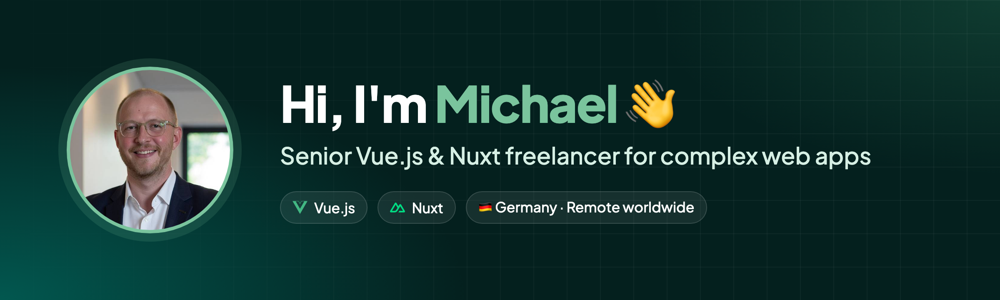
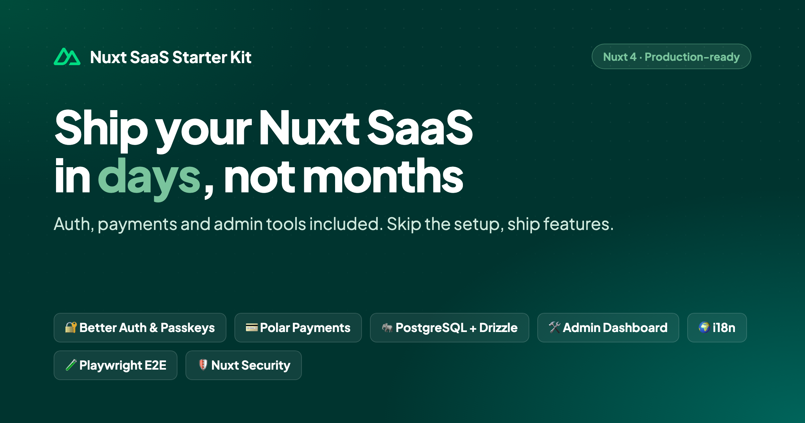
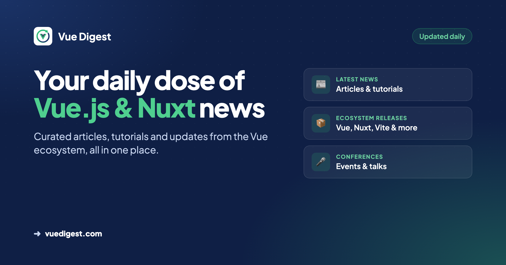

<h2>🧑‍💻 Portfolio</h2>

Senior Vue.js &amp; Nuxt freelancer for complex web apps. Check out my projects, services and how I can help your team.

<h2>🚀 Nuxt SaaS Starter Kit</h2>
  
<h2>📰 Vue Digest</h2>

Your daily dose of Vue.js &amp; Nuxt: latest news, ecosystem releases &amp; conferences.

  